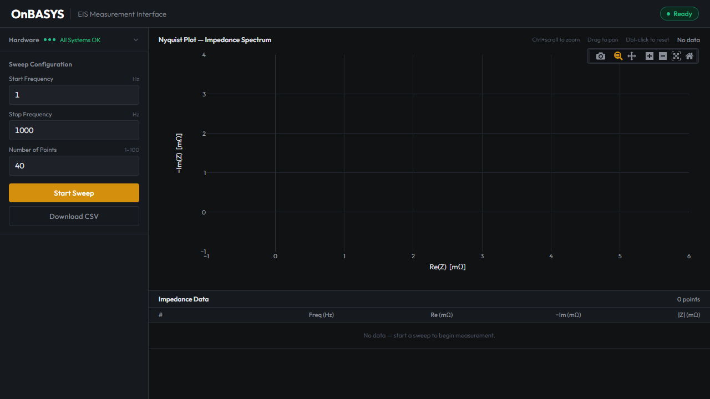

# EIS Measurement System

Browser-based Electrochemical Impedance Spectroscopy (EIS) interface.
Click **Start Sweep** in the browser, and impedance data flows from the AD5941 analog front-end through CAN bus to a live Nyquist plot.



## How It Works

```
Browser  <-->  Flask Server  <-->  python-can  <-->  Vector VN1640A
                                                        |
                                                     CAN bus (125 kbps)
                                                        |
                                               MCP2515 (SBC-CAN01)
                                                        |
                                                    SPI  |  SPI
                                                        |
                                              ADICUP3029 + AD5941
                                                        |
                                                  Device Under Test
```

## Prerequisites

Install these **once** on the PC before first use:

| Requirement | Details |
|-------------|---------|
| **Python 3.10+** | [python.org/downloads](https://www.python.org/downloads/) — check "Add to PATH" during install |
| **Vector XL Driver Library** | From Vector website — must match your VN1640A hardware |
| **Vector Hardware Config** | Open Vector Hardware Config (installed with XL Driver). Create app **"EIS-Measurement-System"** and assign **CAN1 = Channel 1 (CH1)** at **125 kbps** |

### Hardware (must be connected and powered)

| Component | Notes |
|-----------|-------|
| Vector VN1640A | Connected via USB |
| EVAL-ADICUP3029 | Powered via USB (also provides UART debug on COM port) |
| Joy-IT SBC-CAN01 | MCP2515 + TJA1050, wired to ADICUP3029 SPI1 (P8 PMOD) |
| EVAL-AD5941BATZ | Plugged into ADICUP3029 Arduino headers |
| CAN cable | VN1640A CH1 DB9 -> SBC-CAN01 CANH/CANL, 120 ohm termination both ends |
| Firmware | `mcp_integration.hex` must already be flashed on ADICUP3029 |

See [docs/wiring.md](docs/wiring.md) for detailed pin connections.

## Quick Start

1. **Clone the repo**
   ```bash
   git clone https://github.com/Pranavshah0907/EIS-Measurement-System.git
   cd EIS-Measurement-System
   ```

2. **Run setup** (creates venv, upgrades pip, installs dependencies, starts server)
   ```
   Double-click setup.bat
   ```
   > **Note:** `setup.bat` uses the virtual environment's own pip for all installs. You do not need to activate the venv manually — the script handles everything.

3. **Use the interface**
   - Browser opens automatically to `http://localhost:8080`
   - Wait for hardware checks to turn green
   - Configure sweep parameters and click **Start Sweep**
   - Nyquist plot updates in real-time as data arrives

To restart later, just double-click `setup.bat` again.

## Project Structure

```
EIS-Measurement-System/
├── setup.bat              <- One-click setup + launch
├── pc/
│   ├── server.py          <- Flask + SocketIO web server
│   ├── can_worker.py      <- CAN bus communication
│   ├── eis_plot.py        <- Nyquist report generator (CLI)
│   ├── requirements.txt   <- Python dependencies
│   ├── templates/
│   │   └── index.html     <- Browser UI
│   └── measurements/      <- Saved .eis measurement files
├── tools/
│   ├── can_check.py       <- Quick CAN hardware diagnostic
│   └── can_monitor.py     <- Live CAN traffic viewer
├── firmware/               <- Embedded C source (reference only)
│   └── mcp_integration/
│       └── src/
├── docs/
│   ├── architecture.md    <- System overview
│   ├── can_protocol.md    <- CAN message definitions
│   └── wiring.md          <- Hardware connections
└── screenshots/
```

## Diagnostics

If something isn't working, see [tools/README.md](tools/README.md) for hardware diagnostic tools.

## Documentation

- [Architecture](docs/architecture.md) — System design and data flow
- [CAN Protocol](docs/can_protocol.md) — Message format and byte-level definitions
- [Wiring](docs/wiring.md) — Pin connections for CAN, SPI, and power

## Firmware

The firmware source code in `firmware/mcp_integration/src/` is included for reference. To modify firmware, you need:
- **Keil MDK v5** with ARM Compiler V5.06 update 7
- **ADuCM302x_DFP** device pack
- Flash via **DAPLINK** (drag `.hex` to the DAPLINK USB drive)

For firmware changes, contact the project maintainer.
